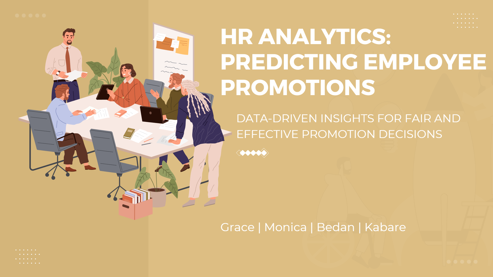
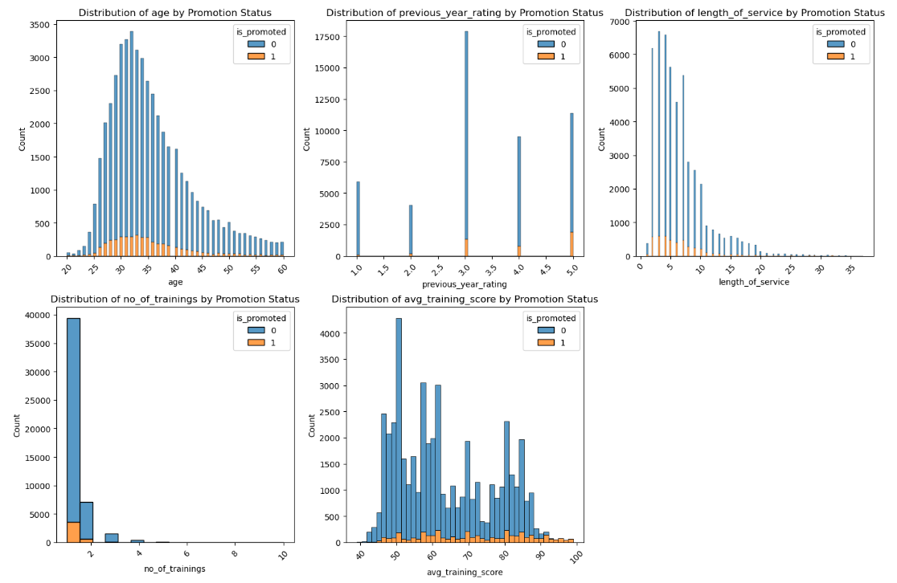
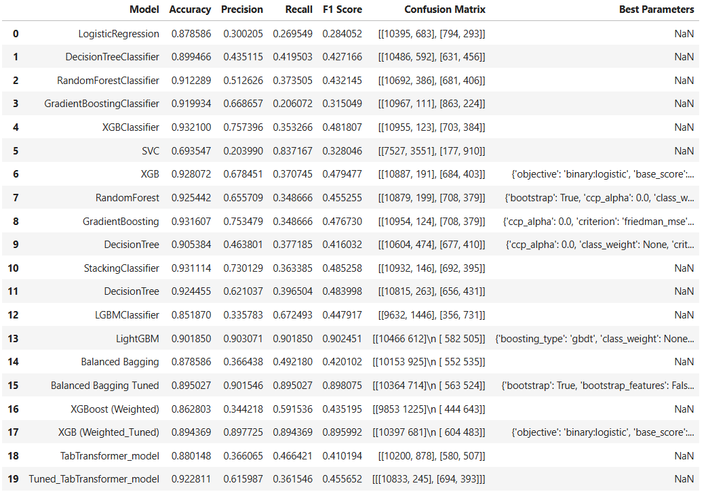
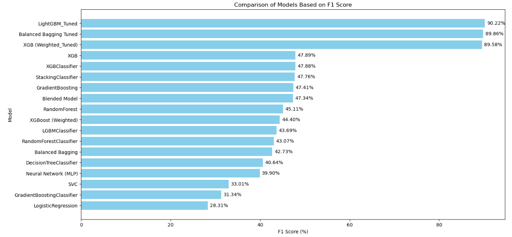

# HR ANALYTICS; Predicting Employee Promotions




## Table of Contents
- [Project Overview](#project-overview)
- [Business Understanding](#business-understanding)
  - [Business Problem](#business-problem)
  - [Stakeholders](#stakeholders)
- [Data Description](#data-description)
- [Objectives](#objectives)
  - [Main Objectives](#main-objectives)
  - [Key Business Questions](#key-business-questions)
- [Methodology](#methodology)
- [Results and Findings](#results-and-findings)
- [Conclusion](#conclusion)
  - [Findings](#findings)
  - [Recommendations](#recommendations)
- [Future Work](#future-work)
- [How to Use This Repository](#how-to-use-this-repository)
- [Requirements](#requirements)
- [Contributors](#contributors)

## Project Overview
This project applies predictive analytics to streamline the promotion process in a large multinational corporation (MNC) with multiple organizational verticals. Currently, identifying candidates for promotion relies heavily on manual HR evaluations and KPI assessments, which are time-consuming and delay decision-making. By building a predictive model, this project aims to help the HR department proactively identify employees eligible for promotion, accelerating their career progression and enhancing HR efficiency.

## Business Understanding

### Business Problem
The promotion process for managerial roles and below is manual and labor-intensive, resulting in delays that affect both employee morale and organizational agility. This project develops a predictive model using demographic and performance data to assist HR in making more efficient, data-driven promotion decisions.

### Stakeholders
- **HR Department**: Primary users of the promotion prediction model.
- **Department Heads and Team Managers**: To understand promotion potential within their teams.
- **Executive Leadership**: For strategic planning and talent management.
- **Data Science/IT Team**: Responsible for maintaining and integrating the model within HR systems.

## Data Description
The project uses two datasets:

1. **Train Dataset**: Contains information on current employees and a target variable indicating if they were promoted.
2. **Test Dataset**: Similar data without the target label, used for model evaluation.

### Key Features
- **employee_id**: Unique identifier.
- **department**: Employee's department.
- **region**: Location of the employee’s role.
- **education**: Highest level of education.
- **gender**: Gender of the employee.
- **recruitment_channel**: Method of recruitment.
- **no_of_trainings**: Number of trainings completed in the last year.
- **age**: Employee's age.
- **previous_year_rating**: Performance rating for the prior year.
- **length_of_service**: Tenure in the organization.
- **KPIs_met >80%**: Indicator of KPI completion over 80%.
- **awards_won?**: Indicator of any awards received in the past year.
- **avg_training_score**: Average score in recent training evaluations.
- **is_promoted**: Target variable indicating promotion recommendation (1 for promoted, 0 otherwise).

## Objectives

### Main Objectives
- **To improve the accuracy and efficiency of the promotion process** by building a machine learning model to identify employees most likely to be promoted.

### Key Business Questions
1. Which employees are most likely to be promoted in the next cycle?
2. What are the primary factors influencing promotion decisions?
3. Are there biases in promotion practices that need addressing?
4. How can training programs be adjusted to boost promotion readiness?
5. How does the likelihood of promotion affect employee retention?

## Methodology

### Exploratory Data Analysis (EDA) 
In the notebook, EDA uses visualizations and correlation analyses to explore distributions and relationships among features, identifying trends that influence promotion, such as `previous_year_rating` and `avg_training_score`. This analysis informs feature engineering and data cleaning steps.


### Feature Engineering 
To enhance model accuracy and interpretability, we engineered new features such as age and service groups, Performance Index, and Career Velocity, capturing patterns in promotion eligibility. We developed composite features like Relative Experience and Training Frequency, providing insights into employee growth and learning. Redundant and sensitive columns were removed to reduce bias, and statistical testing and multicollinearity checks ensured only significant, unique predictors were retained. These data preparation steps created a refined dataset that strengthened the model's ability to identify promotion-eligible employees accurately.

```python
# Creating the relative_experience feature. 
df['relative_experience'] = df['age'] / (df['length_of_service'] + 1)
```
### Data Preprocessing
The notebook preprocesses data by imputing missing values, encoding categorical features, and scaling numerical features. These steps create a structured dataset ready for model training, ensuring consistency and compatibility for machine learning.

### Modelling

#### Model Selection and Training
A variety of models were tested, including **Logistic Regression**, **Decision Tree**, **Random Forest**, **Gradient Boosting**, **XGBoost**, **LightGBM**, and **Support Vector Classifier (SVC)**. Ensemble methods like **Stacking Classifier** and **Balanced Bagging** were also explored.
#### Hyperparameter Tuning
Hyperparameter tuning was performed across several algorithms, with a specific focus on enhancing the **F1 score**. By fine-tuning parameters for **LightGBM**, we optimized its performance, resulting in the highest F1 score observed.<br>
Other models, such as **XGBClassifier** and **Gradient Boosting**, achieved F1 scores of 48.77% and 47.39% respectively, but did not match the optimized performance of the tuned LightGBM model.
#### Ensemble and Stacking Models
The **Stacking Classifier** achieved a balanced F1 score of 46.78% with high accuracy, providing reliable predictions across both precision and recall metrics.
### Evaluation

The F1 score, which balances precision and recall, was chosen to ensure the model accurately identifies promotion-eligible employees while minimizing false positives and negatives.
The tuned LightGBM model emerged as the top performer with an F1 score of 90.19%, making it the most effective model for HR’s goal of accurate promotion predictions. This focus on F1 optimization has led to a model that balances accuracy with equitable, data-driven promotion recommendations.


## Conclusion
### Findings
1. The data highlights a significant imbalance, with a small percentage of employees eligible for promotion.
2. Extensive feature engineering and careful feature selection was done to boost model performance.
3. Initial Model Performance and Tuning Needs: Early model tests indicated low F1 scores, highlighting the need to balance precision (identifying true promotion candidates) and recall (minimizing false negatives).

### Recommendations
1. Explore Advanced Feature Engineering for Richer Insights; adding additional features, such as metrics related to leadership initiatives, cross-departmental collaborations, or innovative contributions, could provide a deeper view into promotion readiness. This would allow us to recognize contributions that align with our company’s values and priorities, giving HR teams a broader context when making promotion decisions.
2. Establish Regular Model Audits; To ensure our model remains accurate and aligned with evolving organizational needs, we suggest scheduling quarterly evaluations and updates. These ongoing reviews will help our model adapt to workforce changes and emerging business objectives, giving stakeholders assurance that promotion processes remain fair and aligned with company goals.
3. Implement Techniques to Address Data Imbalance 
4. Explore Advanced Hyper-Parameter Tuning.

## Future Work
Future improvements may include fine-tuning the model, implementing bias mitigation strategies, and exploring more complex algorithms.

## Installation
To set up and run this project, follow these steps:

1. **Clone the repository:**  
   Clone the project repository from GitHub to your local machine.
    ```bash
    git clone https://github.com/bedankibunja/HR-ANALYTICS-Predicting-Employee-Promotions.git
    ```

2. **Navigate to the project directory:**  
   Change to the project directory to access the files.
    ```bash
    cd HR-ANALYTICS-Predicting-Employee-Promotions
    ```

3. **Install the required dependencies:**  
   Install all necessary packages listed in the `requirements.txt` file.
    ```bash
    pip install -r requirements.txt
    ```

## Usage
To explore the analysis and reproduce the results, follow these steps:

**Open the Jupyter Notebook:**<br>  
Launch the Jupyter Notebook environment and open the file `Notebook.ipynb` located in the repository.<br>
**Follow the Instructions:**<br>  
The notebook contains step-by-step instructions for data loading, preprocessing, feature engineering, model training, and evaluation.<br>
**Execute Code Cells:**<br>  
Run each code cell in sequence to perform the full analysis and view results. You can also modify parameters or experiment with additional features as desired.

To open the notebook, run:
```bash
jupyter notebook Notebook.ipynb
```


## Contributors

- [Monica Anyango](https://github.com/MONISH254)
- [Grace Waceke](https://github.com/wachekeg)
- [Bedan Kibunja](https://github.com/bedankibunja)
- [Martin Kabare](https://github.com/glk-19)